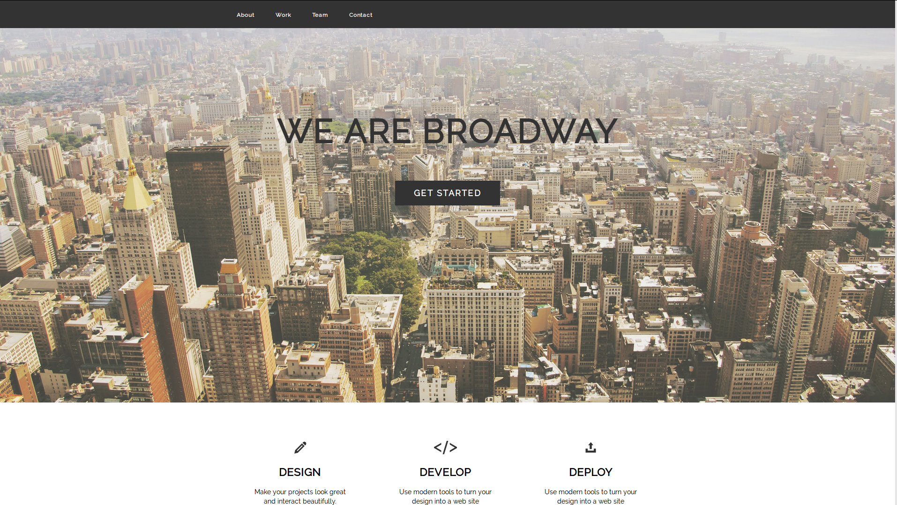

A Front-end project with a excellent way about how to put a Perfect Full Page Background Image. To build this project, I've used HTML, CSS and Bootstrap.

If you want get more information about how do it, you'll find <a href="https://css-tricks.com/perfect-full-page-background-image/">here</a>.

 You can see it working in my <a href="http://codepen.io/LuKrebs/pen/full/jBeaPx">Codepen Profile</a>.

Here's an image that give an idea about what this project looks like :

